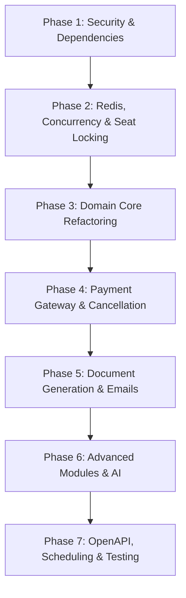

# Spring Boot Flight Booking Backend Audit Report

**Date:** August 12, 2026  
**Target Project:** Flight Booking Backend System (`com.example.flight`)  
**JDK Version:** Java 21  
**Framework:** Spring Boot 4.1.0  

---

## 1. Executive Summary

This backend audit presents a detailed assessment of the existing Spring Boot Flight Booking Application codebase. The application currently implements foundational domain models, JPA repositories, REST controllers, and basic Spring Security authentication. However, key requirements such as distributed Redis seat locking, Redis caching, PDF/QR ticket generation, AI customer support, swagger documentation dependencies, comprehensive test suites, and strict transaction management are missing or incomplete.

Crucially, **no implementation fixes have been performed** as per instructions. This document outlines the status of all 30 required business modules, identifies structural & security flaws, and lays out a phased implementation roadmap.

---

## 2. Module Audit Matrix (30 Modules)

| # | Business Module | Status | Findings & Implementation Status |
|---|---|---|---|
| 1 | **Authentication / User** | **PARTIAL** | Basic registration, login, JWT issuance, refresh tokens, and password reset endpoints exist. Missing role-based authority checks on secured routes and OAuth2 integration. |
| 2 | **Flight Management** | **PARTIAL** | CRUD endpoints present in `FlightController`. Missing status transition tracking, flight delay triggers, and multi-leg segment management. |
| 3 | **Airline** | **DONE** | Full CRUD operations for Airline entity implemented in `AirlineController` & `AirlineService`. |
| 4 | **Airport** | **DONE** | Full CRUD operations for Airport entity implemented in `AirportController` & `AirportService`. |
| 5 | **Aircraft** | **MISSING** | `Aircraft` entity is completely missing. Aircraft models/capacity are embedded or missing from `Flight`. |
| 6 | **Flight Search** | **PARTIAL** | Single-leg JPA queries implemented in `SearchLogService`/`FlightService`. Missing multi-city/return flights search, airline filtering, and cached search queries. |
| 7 | **Flight Pricing** | **PARTIAL** | `FlightPricing` entity and basic price lookup exist. Missing dynamic pricing algorithms, surge pricing, and multi-currency conversion logic. |
| 8 | **Booking** | **PARTIAL** | Booking workflow creates booking records, segments, and passengers. Lacks transactional safety, pessimistic seat reservation checks, and idempotent booking creation. |
| 9 | **Passenger** | **DONE** | Entity, service, and controller present for managing passenger details attached to bookings. |
| 10 | **Seat Management** | **PARTIAL** | Auto seat allocation logic exists in `SeatLockService`. Lacks visual seat layout/map mapping by cabin class and aircraft model. |
| 11 | **Redis Seat Locking** | **BROKEN / MISSING** | **Redis is not integrated**. Seat locking is simulated via PostgreSQL `SeatLock` entity without database locking hints, causing severe race conditions under concurrent requests. |
| 12 | **Payment** | **PARTIAL** | Mock payment execution in `PaymentService`. Missing real gateway SDKs (Stripe/Razorpay), webhook callbacks, signature verification, and idempotency keys. |
| 13 | **Refund** | **PARTIAL** | Refund amounts are calculated during cancellation in `BookingCancellationService`, but refund processing/status updates via payment gateway are missing. |
| 14 | **Cancellation** | **PARTIAL** | Cancellation request entity & logic exist. Lacks automated seat release back to inventory and segment-wise partial cancellation logic. |
| 15 | **Email Notifications** | **PARTIAL** | `EmailService` sends basic plain text emails using `JavaMailSender`. Lacks HTML templates (Thymeleaf/FreeMarker) and attachment support (tickets/invoices). |
| 16 | **QR Ticket** | **MISSING** | No ZXing or QR generation library integrated. QR code rendering for boarding passes is missing. |
| 17 | **PDF Ticket** | **MISSING** | No OpenPDF/iText dependency integrated. Ticket PDF document generation service missing. |
| 18 | **PDF Invoice** | **MISSING** | Invoice PDF rendering engine and template missing. |
| 19 | **Reviews** | **MISSING** | `Review` entity, repository, service, and controller are missing completely. |
| 20 | **Coupons** | **MISSING** | `Coupon` / Discount system missing from entity model and service layer. |
| 21 | **Loyalty** | **MISSING** | Frequent flyer / loyalty points program missing. |
| 22 | **Baggage** | **PARTIAL** | Baggage is represented only as an enum value in `AddOnType`. Dedicated baggage policy and weight tracking are missing. |
| 23 | **Meal Preferences** | **PARTIAL** | Represented only as an enum value in `AddOnType`. Lacks special dietary menu management and meal mapping to passengers. |
| 24 | **AI Customer Support** | **MISSING** | No Spring AI / OpenAI integration or AI support assistant endpoints present. |
| 25 | **Redis Caching** | **MISSING** | No Spring Data Redis starter or `@Cacheable` / `@CacheEvict` annotations used. |
| 26 | **Admin Dashboard** | **PARTIAL** | `/admin/**` routes permitted in `SecurityConfig`, but specialized admin analytics endpoints (revenue, booking trends, occupancy rates) are missing. |
| 27 | **Audit Logging** | **PARTIAL** | `SearchLog` exists for logging flight searches. Missing global entity auditing (`@CreatedDate`, `@LastModifiedBy`, Spring Data Envers). |
| 28 | **Scheduled Jobs** | **MISSING** | `@EnableScheduling` missing. No automated jobs for releasing expired seat locks or marking stale un-paid bookings as cancelled. |
| 29 | **Swagger / OpenAPI** | **PARTIAL** | `SecurityConfig` allows swagger UI paths, but `springdoc-openapi-starter-webmvc-ui` dependency is missing from `pom.xml`. Swagger endpoint returns 404. |
| 30 | **Testing** | **MISSING** | Only an empty context test (`FlightApplicationTests.java`) exists. Zero controller, service, or repository unit/integration tests exist. |

---

## 3. Deep Codebase Defect & Risk Analysis

### 3.1 Hard-coded Configuration & Secrets in Configuration
- **Database Credentials:** `application.properties` previously contained db credentials (`spring.datasource.password=${SPRING_DATASOURCE_PASSWORD}`).
- **SMTP Credentials:** Email credentials loaded via environment configuration (`spring.mail.password=${SPRING_MAIL_PASSWORD}`).
- **JWT Secrets:** Secret keys and token expiration limits are defined directly in code inside `JwtService.java` rather than loaded via `@Value` or `@ConfigurationProperties`.

### 3.2 Security & Authorization Vulnerabilities (IDOR & Role Checks)
- **IDOR (Insecure Direct Object Reference):** In `BookingController`, `PassengerController`, and `PaymentController`, methods fetch resources directly by ID (e.g., `/api/bookings/{id}`) without checking if the authenticated principal owns the booking.
- **Inadequate Role Enforcement:** `SecurityConfig` defines endpoint access control loosely, but method-level security (`@PreAuthorize("hasRole('ADMIN')")`) is absent across services.
- **Lack of Input Sanitization:** DTOs lack validation annotations like `@NotBlank`, `@Size`, and `@Pattern`.

### 3.3 Concurrency, Race Conditions & Missing Redis Integration
- **Seat Locking Defect:** `SeatLockService` attempts concurrency control via standard database inserts into `SeatLock`. Without Redis or pessimistic DB locks (`@Lock(LockModeType.PESSIMISTIC_WRITE)`), two concurrent users booking the same seat will both succeed, leading to **double bookings**.
- **Lack of Distributed Caching:** Frequent queries like airport lists, flight schedules, and pricing tiers query PostgreSQL directly on every request.

### 3.4 Transactional Integrity & N+1 Query Risks
- **Missing `@Transactional` Annotations:** Multi-step business processes in `BookingService` (creating booking, adding segments, adding passengers, locking seats) lack explicit `@Transactional` declarations, leading to partial writes if failure occurs mid-stream.
- **N+1 Performance Bottlenecks:** Lazy-loaded relationships (`Booking.bookingSegments`, `Booking.passengers`, `Flight.pricing`) fetched in loops inside controllers trigger N+1 queries.

### 3.5 Database & Model Imperfections
- **Missing Indexes:** Key foreign keys and search columns (`flight_number`, `departure_airport_id`, `arrival_airport_id`, `departure_time`, `status`) lack DB indexes.
- **Missing `Aircraft` Domain Entity:** `Flight` entity stores raw string data for aircraft instead of linking to a managed `Aircraft` model with total seat capacity and layout configurations.

### 3.6 Inconsistent Exception Handling
- `GlobalExceptionHandler` handles basic custom exceptions (`ResourceNotFoundException`), but unhandled generic exceptions expose internal stack traces. Runtime database exceptions (e.g. `DataIntegrityViolationException`) are not gracefully mapped to standard error contracts.

---

## 4. Architectural Summary & Synthesis

### 4.1 Current Architecture
- Layered Spring Boot Monolith (`Controller` -> `Service` -> `Repository` -> `PostgreSQL`).
- Security: Spring Security + JJWT stateless authentication filter.
- Serialization: Jackson JSON + ModelMapper for DTO entity transformations.
- External Integration: Spring Boot Starter Mail (`JavaMailSender`).

### 4.2 Current Completed Features
- User Registration, Login, Refresh Token issuing & Password Reset OTP flow.
- Airline & Airport CRUD operations.
- Basic Flight creation and search logging.
- Passenger details attachment to bookings.
- Mock Payment record creation.

### 4.3 Missing Features
- Aircraft Entity & Seat Map Management.
- Redis-based Seat Locking and Cache Layer.
- Stripe / Razorpay Payment Gateway & Webhook integration.
- PDF Ticket, PDF Invoice & QR Code Boarding Pass Generators.
- Review / Feedback system, Coupon / Discount engine, Loyalty Points system.
- AI Support Chatbot integration.
- Springdoc OpenAPI UI integration.
- Scheduled cleanup background tasks.
- Comprehensive Unit & Integration Test Suite.

### 4.4 Critical Bugs & Security Issues
1. Double-booking race conditions due to non-atomic seat locking.
2. Insecure Direct Object References (IDOR) across user booking & payment endpoints.
3. Plaintext secrets in `application.properties` and hard-coded JWT keys.
4. Non-transactional booking creation causing inconsistent DB states.
5. Missing Swagger UI dependency causing missing API docs.

---

## 5. Recommended Implementation Order (Phased Roadmap)

### **Phase 1: Infrastructure, Security & Configuration Hardening**
- **Objective:** Fix dependency gaps, extract secrets, fix IDOR security flaws, enable Method Security.
- **Files to Modify:**
  - `pom.xml` (Add `springdoc-openapi-starter-webmvc-ui`, `spring-boot-starter-data-redis`)
  - `application.properties` (Extract secrets to environment variables, configure Redis properties)
  - `com.example.flight.config.SecurityConfig` (Enable `@EnableMethodSecurity`, refine request matchers)
  - `com.example.flight.config.JwtAuthenticationFilter` & `JwtService` (Inject JWT secret/expiration from config)
  - `com.example.flight.service.BookingAccessService` (Implement strict ownership verification)
  - `com.example.flight.controller.BookingController`, `PaymentController`, `PassengerController` (Add security checks)

### **Phase 2: Redis Integration & Concurrency Control (Seat Locking & Caching)**
- **Objective:** Replace DB-based seat lock with atomic Redis seat locking (Redisson/Spring Redis) and add query caching.
- **Files to Modify / Create:**
  - `[NEW] com.example.flight.config.RedisConfig`
  - `[MODIFY] com.example.flight.service.SeatLockService` (Use Redis template / Redisson distributed locks)
  - `[MODIFY] com.example.flight.service.FlightService`, `AirportService` (Add `@Cacheable` for static metadata)

### **Phase 3: Core Domain Refactoring & Transactional Integrity**
- **Objective:** Add missing `Aircraft` entity, fix N+1 queries with fetch joins, add `@Transactional` across services.
- **Files to Modify / Create:**
  - `[NEW] com.example.flight.entity.Aircraft`
  - `[NEW] com.example.flight.repository.AircraftRepository`
  - `[MODIFY] com.example.flight.entity.Flight` (Relate to Aircraft)
  - `[MODIFY] com.example.flight.service.BookingService` (Add `@Transactional`, fix lock validation)
  - `[MODIFY] com.example.flight.repository.BookingRepository` (Add `@Query` with `JOIN FETCH`)

### **Phase 4: Payment Gateway & Cancellation Workflow**
- **Objective:** Integrate payment gateway, webhooks, automated refund logic, and partial segment cancellation.
- **Files to Modify:**
  - `com.example.flight.service.PaymentService` (Add payment gateway integration)
  - `com.example.flight.service.BookingCancellationService` (Trigger gateway refund and seat release)
  - `com.example.flight.controller.PaymentController` (Add webhook endpoint)

### **Phase 5: Document Generation (PDF/QR) & Email Templates**
- **Objective:** Add ZXing & OpenPDF dependencies, generate QR boarding passes, PDF tickets/invoices, send HTML emails.
- **Files to Modify / Create:**
  - `pom.xml` (Add `zxing`, `openpdf`, `thymeleaf`)
  - `[NEW] com.example.flight.service.QrCodeService`
  - `[NEW] com.example.flight.service.PdfGeneratorService`
  - `[MODIFY] com.example.flight.service.EmailService` (Send HTML emails with PDF/QR attachments)

### **Phase 6: Advanced Modules (Reviews, Coupons, Loyalty, AI)**
- **Objective:** Implement missing business features.
- **Files to Modify / Create:**
  - `[NEW] com.example.flight.entity.Review`, `Coupon`, `LoyaltyPoint`
  - `[NEW] com.example.flight.service.ReviewService`, `CouponService`, `LoyaltyService`, `AiSupportService`
  - `[NEW] com.example.flight.controller.ReviewController`, `CouponController`, `LoyaltyController`, `AiSupportController`

### **Phase 7: Scheduled Jobs, Swagger OpenAPI & Test Suite**
- **Objective:** Enable background scheduling, verify Swagger UI documentation, and write JUnit 5 & Mockito test suites.
- **Files to Modify / Create:**
  - `[MODIFY] com.example.flight.FlightApplication` (Add `@EnableScheduling`)
  - `[NEW] com.example.flight.scheduler.SeatLockCleanupScheduler`
  - `[NEW] com.example.flight.service.BookingServiceTest`, `AuthServiceTest`, `PaymentControllerTest`
